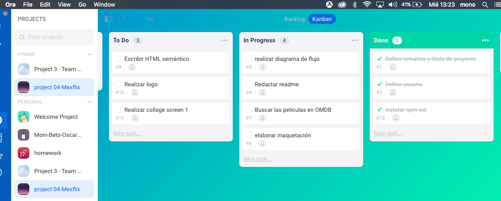
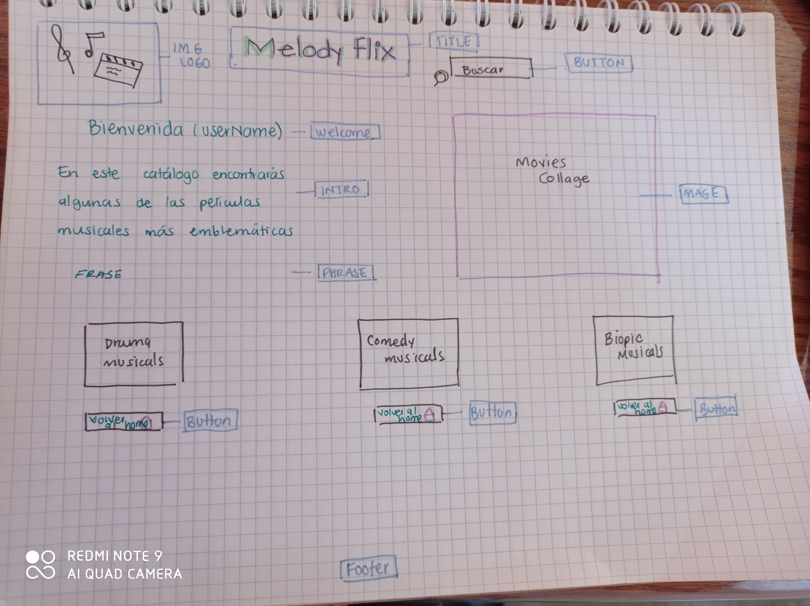
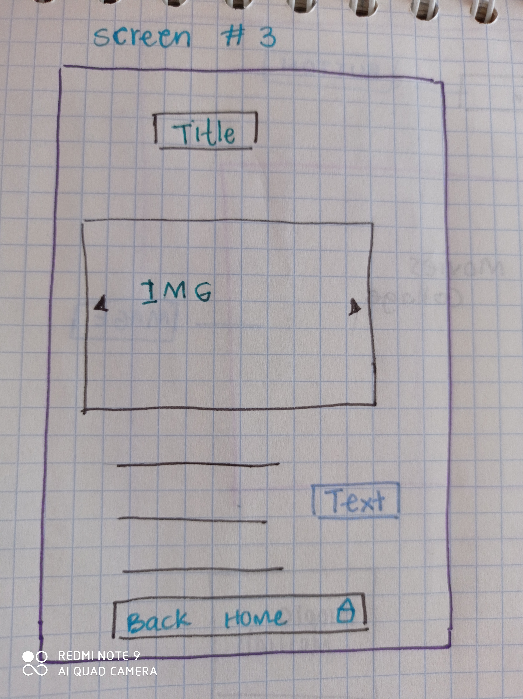
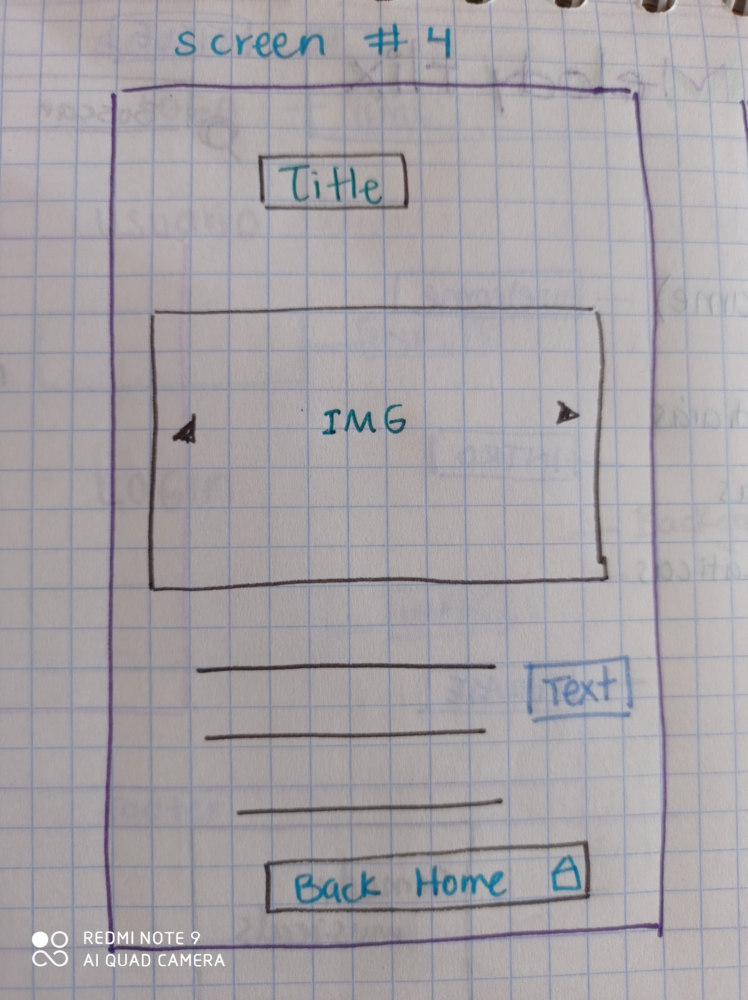
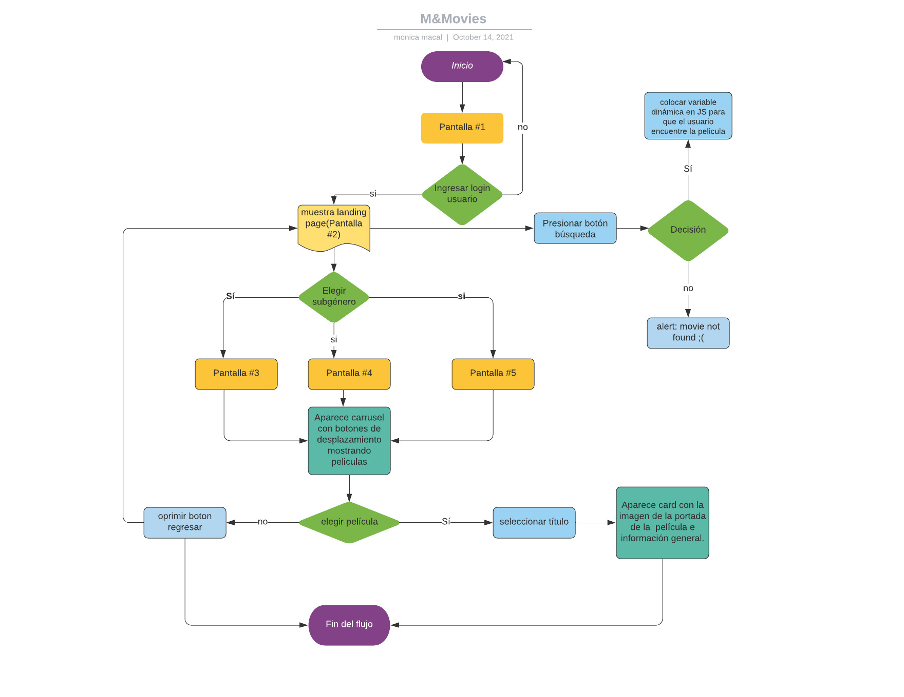
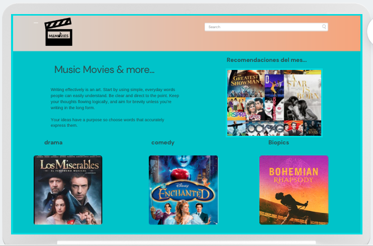
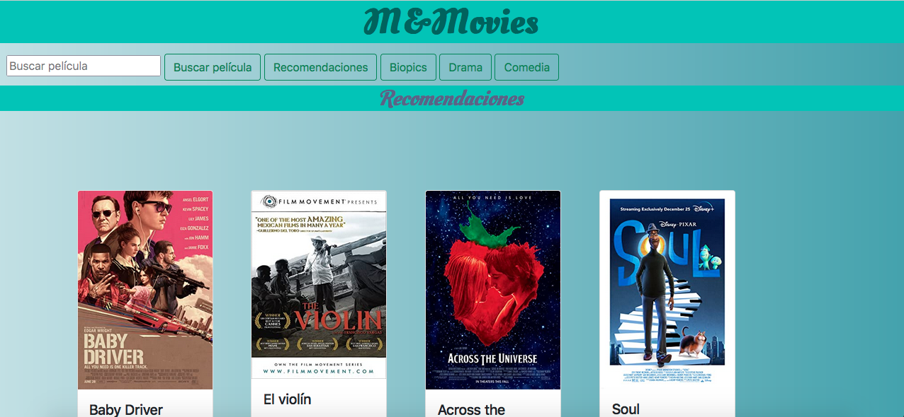

# M&Movies 
---
Índice

    1. Descripción
    2. Definición de Usuario e Historias de usuario (UX)
    3. Requerimientos técnicos
    4. Pseudocódigo
    5. Producto final
   
---
## 1. Descripción

En esta página se muestra un catálogo de algunas películas musicales, y se divide en tres subgéneros:
* Musicales de drama
* Musicales de comedia
* Biopics musicales

## 2. Definición de usuario:

El grupo de usuarios al que va dirigido el producto osn profesores y estudiantes de teatro, danza y música.
La utilizacion de la plataforma puede ser didáctica para su aprendizaje y formación. 

## Historias de usuario:

 - Los usuarios quieren leer una selección adecuada de películas recomendadas para sus intereses.

- El usuario quiere ver un buen catálogo de películas ya preseleccionadas.

- El usuario quiere poder buscar para encontrar más películas por título, género y actores. 

## Proceso de flujo de trabajo

Se utiliza el método agile para distribuir las tareas del proyecto

## 3. UI(user interface)

## Diagrama de flujo

4.Pseudocódigo 
### 📋
## Sección HTML

* Se crean las pantallas
* se crean las secciones de nuestro catálogo
* Se utiliza una plantilla de barra de navegación y card mediante link de bootstrap

## Sección index.js

* En esta sección se controla el DOM
* Se asigna funcionalidad a los botones de búsqueda
## Sección data.js

* Se realizan consultas a la API de las peículas, posteriormente se crea una fx parta la búsqueda.
* Para que el contenido sea dinámico se itera mediante la fx: FOR OF
* Se declara una función para renderizar cada sección
* Se crea un arreglo con las ID de las peliculas preseleccionadas
* Se imprime en el browser mediante la propiedad: INNER HTML

## 7. Testing

La visualización de la pantalla 1 permite al usuario acceder mediante el atajo de clickear en la imagen ó ingresar mediante un formulario con usuario y contraseña.

En la pantalla 2, se muestra Título de la página botón de búsqueda y botones para acceder 
a cada sección del catálogo.

* Producto final:

##  CopyRight

© Copyright 2021-Proyecto#4- Mexflix streaming by Monica Macal