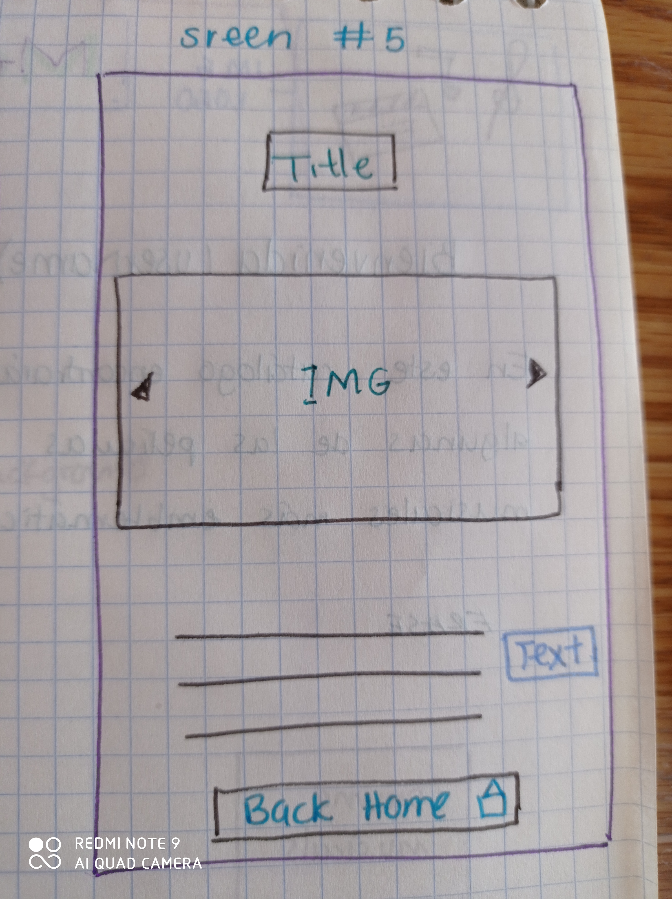

# M&Movies 
---
Índice

    1. Descripción
    2. Definición de Usuario e Historias de usuario (UX)
    3. Criterios de aceptación
    4. Requerimientos técnicos
    5. Edición Hacker 
    6. Pseudocódigo
    7. 
   
---
## 1. Descripción

En esta página se muestra un catálogo de algunas películas musicales, y se divide en tres subgéneros:
* Musicales de drama
* Musicales de comedia
* Biopics musicales

## 2. Definición de usuario:

El grupo de usuarios al que va dirigido el producto osn profesores y estudiantes de teatro, danza y música.
La utilizacion de la plataforma puede ser didáctica para su aprendizaje y formación. 

## Historias de usuario:

 - Los usuarios quieren leer una selección adecuada de películas recomendadas para sus intereses.

- El usuario quiere ver un buen catálogo de películas ya preseleccionadas.

- El usuario quiere poder buscar para encontrar más películas por título, género y actores. 

## Proceso de flujo de trabajo

Se utiliza el método agile para distribuir las tareas del proyecto

## 3. UI(user interface)

## Diagrama de flujo

##  CopyRight

© Copyright 2021-Proyecto#4- Mexflix streaming by Monica Macal